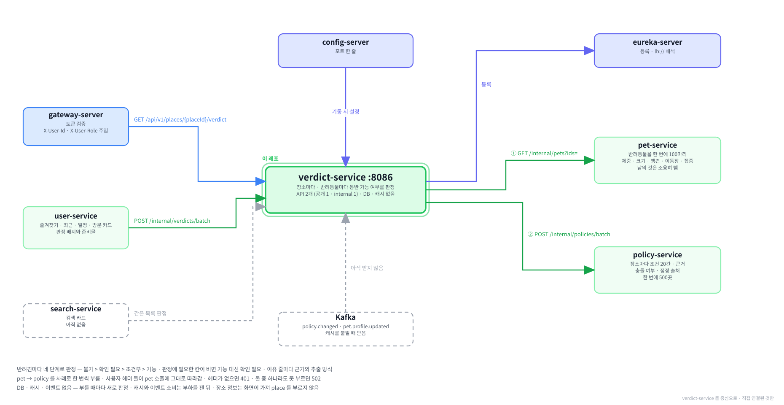

# verdict-service

**함께하개**는 반려동물과 함께 갈 수 있는 장소를 찾고, 우리 아이가 그곳에
들어갈 수 있는지 판정해 주는 서비스입니다.

이 저장소는 그중 **장소마다 · 반려동물마다 동반 가능 여부를 판정하는 서버**입니다.
조건 서비스(policy)가 가진 동반 조건 20칸을 반려동물 서비스(pet)가 가진 체중 · 크기 · 맹견 여부와 대조해
"가능 · 조건부 · 확인 필요 · 불가" 와 그 이유를 냅니다.

---

**먼저 전체 그림을 보고, 이 레포가 그 안 어디에 있는지 본 뒤 읽습니다.**

**① 전체 구조 — 층으로 본 것.** 위에서 아래로 요청이 내려가고, 어느 층에 무엇이 있는지.


**② 전체 구조 — 서비스끼리 무엇을 주고받는지.** 초록 실선이 `/internal` 호출, Kafka 표가 이벤트, 하늘색 점선이 VPC 경계.


**③ 이 레포를 중심으로.** 직접 연결된 것만 남긴 그림.



<br><br>

---

## 본문 시작

<br><br>

---

## 0. 이 서비스가 하는 일

### 0-1. 한 문장

> 장소의 동반 조건(policy)과 반려동물 정보(pet)를 받아, 반려동물 한 마리마다 "그곳에 들어갈 수 있는가" 를
> 네 단계로 판정하고 그 이유를 근거 문장과 함께 냅니다.

예를 들어 조건 서비스가 한 여행지(눈꽃여행)의 조건을 이렇게 들고 있습니다.

| 칸 | 값 | 근거 문장 | 읽은 방식 |
|---|---|---|---|
| 동반 범위 | 전 구역 | `전구역 동반가능` | 공공데이터 항목 (`RULE`) |
| 크기 제한 | 소형견만 | `소형견` | 안내문을 AI 가 읽음 (`LLM`) |
| 목줄 | 필요 | `목줄 착용` | 안내문을 AI 가 읽음 (`LLM`) |

그 밖의 칸은 비어 있거나, 판정에 줄을 남기지 않는 값입니다.

이 서비스는 반려견 두 마리를 이렇게 판정합니다. 이유 줄은 막힌 것부터 늘어놓습니다.

| 반려견 | 판정 | 이유 줄 |
|---|---|---|
| 중형견 12kg | 불가 (`NOT_ALLOWED`) | `NOT_MET` 크기 제한 — 중형견(12kg) — 소형견만 · `MET` 동반 범위 — 전 구역 동반 가능 · `INFO` 목줄 — 필요 |
| 소형견 8kg | 가능 (`ALLOWED`) | `MET` 동반 범위 — 전 구역 동반 가능 · `MET` 크기 제한 — 소형견(8kg) — 소형견만 · `INFO` 목줄 — 필요 |

목록 카드에는 이 장소에 한 줄 근거 `크기 제한: 소형견` 과 준비물 `목줄` 이 붙습니다.

---

### 0-2. 다른 서비스와의 자리

```
브라우저 ──▶ gateway-server ──장소 상세──▶ verdict-service ──반려동물──▶ pet-service
                                                  ▲        └──동반 조건──▶ policy-service
user-service ──목록 판정 (카드 배지와 준비물)─────┘
```

| 상대 | 이 서비스가 하는 일 | 경로 |
|---|---|---|
| 브라우저 (게이트웨이를 거침) | 장소 상세의 판정 — 마리마다 이유 줄까지 | `GET /api/v1/places/{placeId}/verdict?petIds=` |
| user-service | 즐겨찾기 · 최근 본 장소 · 일정 · 방문 카드의 판정 배지와 준비물 | `POST /internal/verdicts/batch` |
| pet-service | 판정할 반려동물의 체중 · 크기 · 맹견 여부 · 이동장 · 접종 증명서를 한 번에 받음 | `GET /internal/pets?ids=` |
| policy-service | 장소들의 동반 조건 20칸 · 근거 · 충돌 여부를 한 번에 받음 | `POST /internal/policies/batch` |

**이 서비스에는 DB 도 캐시도 없습니다.** 부를 때마다 pet 과 policy 에서 받아 새로 판정합니다.
판정은 두 서비스의 값으로 언제든 다시 계산되는 값이라 저장해 둘 것이 없습니다. 캐시는 부하를 재 본 뒤에 붙입니다([13장](#13-아직-안-한-것)).

**이벤트를 내지도 받지도 않습니다.** 조건이나 반려동물이 바뀌었다는 이벤트(`policy.changed` · `pet.profile.updated`)는
캐시를 지우려고 받는 것인데, 캐시가 없으니 받아서 할 일이 없습니다.

**장소 서비스(place)를 부르지 않습니다.** 장소 이름 · 종류 · 기준일은 화면이 이미 가진 값을 씁니다([11장](#11-왜-이렇게-만들었나)).

---

### 0-3. 무엇이 들어 있나

| 들어 있는 것 | 하는 일 | 자세히 |
|---|---|---|
| 판정 규칙 | 조건 20칸을 한 마리와 대조해 이유 줄을 만들고, 그중 가장 센 결과를 판정으로 냄 | [3장](#3-판정-규칙) |
| 이유 줄 | 칸마다 결과 · 문장 · 근거 문장 · 추출 방식 | [4장](#4-이유-줄) |
| 목록 판정 | 장소 500곳 × 반려동물 100마리를 한 번에 — 판정 값 · 카드 한 줄 근거 · 준비물 | [5장](#5-목록-판정) |
| 상세 판정 | 한 장소 · 여러 마리 — 마리마다 이유 줄까지 | [7장](#7-api) |
| 두 서비스 부르기 | pet 과 policy 를 차례로 한 번씩 | [6장](#6-부르는-두-서비스) |

없는 것도 적어 둡니다. 처음 보는 사람이 가장 많이 찾는 것들입니다.

| 없는 것 | 까닭 |
|---|---|
| DB | 판정은 매번 계산하는 값입니다. 재료는 pet 과 policy 가 가집니다 |
| Redis 캐시 | 아직 없습니다. 부하를 재 보고 붙입니다 |
| Kafka | 캐시가 없으면 조건 변경 이벤트를 받아 할 일이 없습니다 |
| place 호출 | 화면이 장소 정보를 이미 가집니다 |
| 관리자 캐시 비우기 API | 게이트웨이 라우트(`/api/v1/admin/verdicts/**`)만 열려 있고 서버는 아직 없습니다. 캐시를 붙일 때 만듭니다 |

---

### 0-4. 6가지만 기억하면 됩니다

**① 판정은 네 단계이고 앞선 것이 이깁니다.** 불가 → 확인 필요 → 조건부 → 가능 순입니다.
이유 줄 하나라도 "막힘" 이면 불가이고, 막힌 줄이 없는데 빈 칸이 있으면 확인 필요입니다.

**② 모르는 것을 가능으로 올리지 않습니다.** 판정에 필요한 칸이 비어 있으면 "가능" 이 아니라 "확인 필요" 입니다.
조건의 상당수를 AI 가 안내문에서 읽어 100% 맞지 않기 때문입니다.

**③ 반려동물마다 따로 판정합니다.** 여러 마리를 물으면 판정도 이유 줄도 마리마다 나옵니다.
함께 가는 마릿수 제한은 판정에 쓰지 않고 참고 줄로만 보입니다.

**④ 이유 줄마다 근거 문장과 추출 방식이 붙습니다.** 추출 방식이 `RULE` 이면 공공데이터의 정형 칸을 규칙으로 읽은 것이고,
`LLM` 이면 안내문을 AI 가 읽은 것입니다. 화면은 이것으로 "공공데이터 항목" · "안내문을 AI 가 읽음" 을 붙입니다.

**⑤ 부를 때 사용자 헤더 둘(`X-User-Id` · `X-User-Role`)이 있어야 합니다.** pet 은 이 값으로 남의 반려동물을 걸러 냅니다.
헤더가 없으면 pet 을 부르기 전에 401 입니다.

**⑥ pet 이나 policy 를 못 부르면 요청 전체가 502 입니다.** 부르지 못한 것을 "확인 필요" 로 채우면
정상 상태와 장애가 같은 값으로 보이기 때문입니다. 부르는 쪽은 502 를 "불러오지 못함" 으로 안내합니다.

---

### 0-5. 화면에서 어디에 쓰이나

| 화면 | 쓰이는 것 | 부르는 곳 |
|---|---|---|
| 즐겨찾기 · 최근 본 장소 · 일정 · 방문 기록 카드 | 대표 반려동물 기준 판정 배지 · 준비물 | user-service → 목록 판정 |
| 검색 카드 | 판정 배지 · 카드 한 줄 근거 · 준비물 · 충돌 배지 | search-service(아직 없음) → 목록 판정 |
| 장소 상세 | 마리마다 판정 · 이유 줄 · 근거 문장 · 출처 표시 · 관리자 확인 표시 | 브라우저 → 상세 판정 |

**`UNKNOWN` 의 화면 문구는 "확인 필요" 입니다.** 조건 정보가 아예 없는 장소와, 조건은 있으나 그 반려견에게 필요한 칸이 빈 장소가
둘 다 여기에 듭니다. "조건 정보 없음" 으로 쓰면 크기만 빠진 장소에서 틀린 말이 됩니다.

**동물병원은 판정 배지를 그리지 않습니다.** 이 서비스는 동물병원에도 값을 주지만(대개 `UNKNOWN`), 화면이 장소 종류(`placeType` 이 `VET`)를 보고 숨깁니다.

⚠**AI 가 읽은 조건은 100% 맞지 않습니다.** 정답을 적어 둔 새 원문 40건에서 정밀도 93% · 재현율 94% 안팎입니다
([extract README 7장](https://github.com/paw-trail/extract-service#7-얼마나-맞나)). 그래서 이 서비스는 모르는 것을 가능으로 올리지 않고,
화면은 AI 가 읽은 줄에 그 사실과 근거 문장을 함께 보여 줍니다.

<br><br>

---

## 1. 로컬에서 띄우기

### 1-1. 전체 흐름

| 순서 | 할 일 | 확인 |
|---|---|---|
| ① | 인프라 컨테이너 — postgres · config-server · eureka-server | `docker compose ps` 에 `healthy` |
| ② | 재료 두 서비스 — pet · policy | 둘 다 유레카에 `UP` · policy_db 에 조건이 채워져 있음 |
| ③ | 이미지 준비 — 배포된 이미지를 받거나 직접 굽기 | `docker image ls` 에 `verdict-service` |
| ④ | 이 서비스 실행 | 컨테이너가 `healthy` |
| ⑤ | 떴는지 확인 | 상태 확인 · 유레카 등록 |
| ⑥ | 판정 불러 보기 | 목록 판정 · 상세 판정이 200 |

---

### 1-2. 인프라 컨테이너

infra 레포에서 띄웁니다. 이 서비스는 DB 를 쓰지 않지만, 재료를 주는 pet 과 policy 가 postgres 를 씁니다.

```bash
cd ../infra
docker compose up -d
docker compose ps
```

Windows 와 macOS 가 같습니다. `.env` 의 `COMPOSE_PROFILES` 에 `infra` · `platform` · `db` 가 들어 있어야
postgres · config-server · eureka-server 가 뜹니다. 프로파일의 뜻은 infra README 에 있습니다.

---

### 1-3. 재료 두 서비스

pet 과 policy 를 *이 서비스와 같은 방식으로* 띄웁니다. 이 문서는 셋 다 컨테이너로 띄우는 길을 적습니다.

⛔**IntelliJ 와 컨테이너를 섞으면 서로 못 찾습니다.** 이 서비스는 두 서비스의 주소를 유레카에서 받는데, 컨테이너로 뜬 서비스는
도커 안쪽 주소(`172.18.x.x`)로 등록되어 호스트에서 뜬 쪽이 그 주소에 닿지 못합니다([12-2](#12-2-intellij-와-컨테이너를-섞으면-서로-못-찾습니다)).
이 서비스를 IntelliJ 로 띄우려면 pet 과 policy 도 IntelliJ 로 띄웁니다.

| 서비스 | 포트 | 준비돼 있어야 하는 것 |
|---|---|---|
| pet-service | 8083 | 판정할 반려동물이 한 마리 이상 등록돼 있어야 함 |
| policy-service | 8085 | policy_db 에 조건이 채워져 있어야 함 — 비어 있으면 모든 판정이 "확인 필요" |

policy_db 는 조건 추출 서비스(extract)가 채웁니다. 비어 있으면 [extract README 11-2](https://github.com/paw-trail/extract-service#11-2-전량-돌리기) 로 채웁니다.
두 시간 안팎 걸리므로, 급하면 조건이 채워진 사람의 policy_db 덤프를 받는 편이 빠릅니다.

⚠**policy 는 v0.1.2 이상이면 근거마다 추출 방식이 실립니다.** 그 전 판이면 `extractionMethod` 가 `null` 로 와서
판정은 되지만 화면이 출처(공공데이터 항목 · AI)를 가르지 못합니다.

---

### 1-4. 이미지 준비

**배포된 이미지를 쓸 때** — infra 폴더에서 받습니다. Windows 와 macOS 가 같습니다.

```bash
docker compose --profile infra --profile platform --profile db --profile app pull verdict-service
```

**코드를 고쳐 확인할 때** — 이 레포에서 jar 를 만들고 같은 이름으로 굽습니다. 레지스트리에 올리지 않습니다.
배포 이미지는 태그를 단 `main` 에서만 굽습니다([10-3](#10-3-이미지-굽기)).

```bash
./gradlew clean bootJar
docker build -t ghcr.io/paw-trail/verdict-service:latest .
```

Windows 는 `./gradlew` 대신 `.\gradlew` 를 씁니다. 나머지는 같습니다.

---

### 1-5. 실행

infra 폴더에서 이 서비스와 재료 두 서비스를 함께 올립니다. Windows 와 macOS 가 같습니다.

```bash
docker compose --profile infra --profile platform --profile db --profile app up -d verdict-service pet-service policy-service eureka-server
```

`--profile` 을 명령에 붙이면 `.env` 의 `COMPOSE_PROFILES` 가 통째로 바뀌므로 필요한 프로파일을 모두 적습니다.
`up -d` 에 서비스 이름을 붙이면 기다리는 것만 함께 올라오고 eureka 는 안 올라오므로 함께 적습니다.

직접 구운 이미지를 쓸 때는 `--pull never` 를 붙여 둡니다. 이미지가 없으면 레지스트리에서 받아 오지 않고 바로 알려 주므로, 모르는 사이 배포 이미지로 도는 일이 없습니다.

코드를 고쳐 이미지를 다시 구웠다면 이 서비스만 새로 올립니다.

```bash
docker compose --profile infra --profile platform --profile db --profile app up -d --no-deps --pull never --force-recreate verdict-service
```

---

### 1-6. 떴는지 확인

상태 확인이 `UP` 인 것만으로 끝내지 않고 유레카 등록까지 봅니다. 유레카 등록이 실패해도 상태 확인은 `UP` 으로 나올 수 있습니다.

Windows (PowerShell)

```powershell
(Invoke-RestMethod "http://localhost:8086/actuator/health").status
foreach ($app in "VERDICT-SERVICE", "PET-SERVICE", "POLICY-SERVICE") {
    (Invoke-RestMethod "http://localhost:8761/eureka/apps/$app" -Headers @{ Accept = "application/json" }).application.instance | Select-Object app, ipAddr, status
}
```

macOS (zsh)

```bash
curl -s http://localhost:8086/actuator/health
for app in VERDICT-SERVICE PET-SERVICE POLICY-SERVICE; do
  curl -s -H "Accept: application/json" http://localhost:8761/eureka/apps/$app | grep -o '"ipAddr":"[^"]*"\|"status":"[^"]*"' | head -2
done
```

| 줄 | 나와야 하는 것 |
|---|---|
| 상태 확인 | `UP` |
| 유레카 | 세 서비스가 모두 `UP` 이고 `ipAddr` 가 셋 다 `172.18.x.x` |

---

### 1-7. 판정 불러 보기

DB 에서 반려동물 한 마리와 그 보호자, 조건이 있는 장소 하나를 골라 두 판정을 불러 봅니다. infra 폴더에서 돌립니다.
헤더 둘(`X-User-Id` · `X-User-Role`)은 게이트웨이가 로그인한 사용자로 채워 주는 값인데, 여기서는 서비스를 직접 부르므로 손으로 싣습니다.

Windows (PowerShell) — PowerShell 이 `-d` 인자의 따옴표를 먹으므로 본문을 파일로 넘깁니다.

```powershell
$acc, $pet = ((docker compose exec -T postgres psql -U pawtrail -d pet_db -At -F "," -c "SELECT account_id, id FROM pet WHERE deleted_at IS NULL ORDER BY created_at LIMIT 1").Trim()) -split ","
$place = (docker compose exec -T postgres psql -U pawtrail -d policy_db -At -c "SELECT place_id FROM pet_policy ORDER BY place_id LIMIT 1").Trim()
Set-Content -Path $env:TEMP\verdict-batch.json -Encoding ascii -Value ('{"placeIds":["' + $place + '"],"petIds":["' + $pet + '"]}')

curl.exe -s -X POST "http://localhost:8086/internal/verdicts/batch" -H "Content-Type: application/json" -H "X-User-Id: $acc" -H "X-User-Role: USER" -d "@$env:TEMP\verdict-batch.json"
curl.exe -s "http://localhost:8086/api/v1/places/$place/verdict?petIds=$pet" -H "X-User-Id: $acc" -H "X-User-Role: USER"
```

macOS (zsh)

```bash
IFS=, read ACC PET <<< "$(docker compose exec -T postgres psql -U pawtrail -d pet_db -At -F , -c "SELECT account_id, id FROM pet WHERE deleted_at IS NULL ORDER BY created_at LIMIT 1")"
PLACE=$(docker compose exec -T postgres psql -U pawtrail -d policy_db -At -c "SELECT place_id FROM pet_policy ORDER BY place_id LIMIT 1")

curl -s -X POST http://localhost:8086/internal/verdicts/batch -H "Content-Type: application/json" -H "X-User-Id: $ACC" -H "X-User-Role: USER" -d "{\"placeIds\":[\"$PLACE\"],\"petIds\":[\"$PET\"]}"
curl -s "http://localhost:8086/api/v1/places/$PLACE/verdict?petIds=$PET" -H "X-User-Id: $ACC" -H "X-User-Role: USER"
```

| 호출 | 나와야 하는 것 |
|---|---|
| 목록 판정 | `data.results` 에 장소 하나 — `verdicts` 에 그 반려동물의 판정 · `evidenceSummary` · `requiredItems` |
| 상세 판정 | `data.verdicts[0].reasons` 에 이유 줄 — 줄마다 `status` · `label` · `message` · `evidence` |

반려동물이 한 마리도 없으면 첫 줄이 빈 값을 냅니다. 화면이나 pet 의 등록 API 로 먼저 한 마리를 등록합니다.
헤더를 빼고 부르면 목록 판정은 401 `AUTHENTICATION_FAILED`, 상세 판정은 보안 설정이 막아 401 이 나오는 것이 정상입니다.

<br><br>

---

## 2. 판정이라는 것

### 2-1. 네 단계

판정 값은 넷입니다. 사용자 서비스가 이 넷만 받으므로 값을 더하거나 이름을 바꾸지 않습니다.

| 값 | 화면 문구 | 뜻 |
|---|---|---|
| `ALLOWED` | 가능 | 막는 칸도, 비어 있는 필요한 칸도 없음. 참고 줄(목줄 · 준비물 · 요금 · 마릿수)만 있을 수 있음 |
| `CONDITIONAL` | 조건부 가능 | 들어갈 수 있으나 가서 지킬 것이 있음 — 구역 · 요일 · 사전 문의 · 이동장 · 접종 증명서 · 맹견 입마개 |
| `UNKNOWN` | 확인 필요 | 판정에 필요한 칸이 비어 있음 — 조건 정보가 아예 없는 장소도 여기 듦 |
| `NOT_ALLOWED` | 불가 | 그 반려견을 막는 칸이 있음 |

조건 충돌은 다섯 번째 값이 아니라 판정과 따로 붙는 표시입니다([2-7](#2-7-충돌은-판정과-따로-알립니다)).

---

### 2-2. 앞선 것이 이깁니다

판정은 칸마다 만든 이유 줄의 결과를 모은 것입니다. 줄마다 결과가 하나씩 있고, 가장 센 것이 판정이 됩니다.

| 줄의 결과 | 뜻 | 이 줄만 보면 |
|---|---|---|
| `NOT_MET` | 그 반려견을 막음 | 불가 |
| `MISSING` | 판정에 필요한데 비어 있음 | 확인 필요 |
| `CONDITION` | 가서 지켜야 함 | 조건부 |
| `MET` | 충족 | 가능 |
| `INFO` | 참고 — 판정에 영향 없음 | 가능 |

세기는 불가 → 확인 필요 → 조건부 → 가능 순입니다. 예를 들어 크기 제한 줄이 `NOT_MET` 이고 제외 구역 줄이 `CONDITION` 이면
판정은 불가입니다. 크기가 막혔으니 구역을 지켜도 들어갈 수 없습니다.

---

### 2-3. 모르는 것을 가능으로 올리지 않습니다

조건 칸의 **빈 값(`null`)은 "원문이 말하지 않았다"** 는 뜻이고, **`false` 는 "요구하지 않는다"** 는 뜻입니다.
둘은 판정이 갈립니다. 조건 서비스가 둘을 구분해 저장하고, 이 서비스도 구분해 읽습니다.

판정에 꼭 필요한 칸이 비어 있으면 "가능" 이 아니라 "확인 필요" 를 냅니다.

| 필요한 칸 | 누구에게 | 비어 있으면 |
|---|---|---|
| 동반 범위 · 실내 · 실외 | 모든 반려견 — 어디서든 된다는 말이 하나라도 있어야 함 | 확인 필요 |
| 크기 제한 · 체중 제한 | 모든 반려견 — 둘 중 하나라도 있어야 함 | 확인 필요 |
| 견종 제한 | 맹견만 | 확인 필요 |

**이동장 · 접종 증명 · 안내견 한정은 비어 있어도 막지 않습니다.** 원문이 이것을 말하는 곳이 드뭅니다
(조건 행 가운데 이동장을 말한 곳이 3% 남짓이고, 접종 증명은 1% 가 안 됩니다). 비어 있을 때 막으면 거의 모든 장소가 확인 필요가 되어
판정이 뜻을 잃습니다. 원문이 "필요하다" 고 말한 곳에서만 그 반려견이 갖췄는지 봅니다.

**왜 이렇게 보수적인가.** 조건의 상당수를 AI 가 안내문에서 읽었고, 새 원문으로 재 보면 정밀도 · 재현율이 93~94% 안팎입니다.
모르는 것을 가능으로 올리면 손님이 가서 거절당합니다. 이 서비스가 지키는 것은 "잘못 안내하지 않기" 입니다.

---

### 2-4. 조건부는 "그대로 가면 막힐 수 있다" 는 뜻입니다

조건부가 되는 것은 둘로 나뉩니다.

| 묶음 | 칸 | 예 |
|---|---|---|
| 장소가 거는 제한 | 일부 구역 · 실내만 · 실외만 · 동반 가능 구역 · 동반 불가 구역 · 동반 불가일 · 사전 문의 | "실외에서만 동반 가능" · "월요일 동반 불가" |
| 입구에서 갖춰야 하는 것 | 이동장(유모차로도 됨) · 접종 증명서 · 맹견 입마개 | 이동장이 있는 반려견에게 "필요 — 이동장 있음" |

입구에서 갖춰야 하는 것을 반려견이 *안 갖췄으면* 조건부가 아니라 불가입니다.

**목줄 · 준비물 · 추가 요금 · 마릿수 · 반려견 동반 전용은 조건부가 아닙니다.** 참고 줄로만 보입니다.
이것까지 조건부로 올리면 동반되는 곳 대부분이 조건부가 되어, 정말 이유를 읽어야 하는 곳이 묻힙니다.
지금도 실내만 · 실외만 · 일부 구역인 곳이 조건 행의 45% 안팎이라 조건부가 가장 흔한 값입니다.

---

### 2-5. 반려동물마다 따로 판정합니다

여러 마리를 물으면 마리마다 판정과 이유 줄이 따로 나옵니다. 12kg 반려견은 불가이고 8kg 반려견은 가능인 장소가 흔합니다.

**함께 가는 마릿수 제한은 판정에 쓰지 않습니다.** 판정은 한 마리씩 내는데 마릿수는 함께 가는 무리에 걸리는 조건입니다.
부르는 쪽이 넘기는 반려동물 목록은 함께 가는 무리가 아니라 판정 기준의 목록입니다. 일정 화면은 날마다 다른 반려동물을
한꺼번에 모아 부릅니다. 그래서 마릿수는 "한 번에 2마리까지" 같은 참고 줄로만 보이고, 함께 가는 마릿수를 아는 화면이 견줍니다.

여러 마리의 결과를 한 줄로 줄여야 하는 목록 카드는 제한이 가장 센 마리를 기준으로 삼습니다([5-3](#5-3-카드-한-줄-근거)).

---

### 2-6. 종으로 가르지 않습니다

반려동물은 종(`species`)이 개 · 고양이 · 그 밖으로 나뉘지만, 조건 데이터가 반려견 기준이라 **모든 반려동물을 개 기준으로 판정합니다.**
개가 아닌 반려동물을 골랐을 때 장소 상세 위에 "반려견 기준 판정입니다" 같은 안내를 띄우는 것은 화면이 합니다.
이 서비스는 종을 받지도 않습니다.

---

### 2-7. 충돌은 판정과 따로 알립니다

출처끼리, 또는 한 출처 안에서 조건이 갈린 장소는 조건 서비스가 `hasConflict` 를 참으로 둡니다. 이 서비스는 그 값을 그대로 넘기고
판정에는 쓰지 않습니다.

갈린 칸은 조건 서비스나 추출 서비스가 어느 한쪽을 고르지 않고 비워 둡니다. 그래서 충돌이 있는 장소는 대개 그 칸이 비어
판정이 "확인 필요" 로 떨어지고, 화면에는 충돌 배지가 함께 붙습니다. 무엇이 어떻게 갈렸는지는 조건 서비스의
`GET /api/v1/places/{placeId}/conflicts` 가 보여 줍니다.

<br><br>

---

## 3. 판정 규칙

### 3-1. 한눈에

조건 20칸이 어느 규칙에 쓰이는지입니다. 칸 이름은 조건 서비스의 이름(camelCase)을 그대로 씁니다.

| 칸 | 규칙 | 줄의 결과 |
|---|---|---|
| `scope` 동반 범위 · `indoorAllowed` 실내 동반 · `outdoorAllowed` 실외 동반 | [3-2 가부](#3-2-가부--동반-범위--실내--실외) | 불가 · 확인 필요 · 조건부 · 충족 |
| `guideDogOnly` 안내견 한정 | [3-3](#3-3-안내견-한정) | 불가 |
| `sizeRule` 크기 제한 · `maxWeightKg` 체중 제한 · `weightInclusive` 체중 기준 | [3-4](#3-4-크기와-체중) | 불가 · 확인 필요 · 충족 |
| `breedRule` 견종 제한 | [3-5](#3-5-맹견) — 맹견에만 | 불가 · 확인 필요 · 조건부 · 충족 |
| `carrierRequired` 이동장 · `vaccineProof` 접종 증명 | [3-6](#3-6-이동장과-접종-증명) | 불가 · 조건부 |
| `allowedZonesOnly` 동반 가능 구역 · `excludedZones` 동반 불가 구역 · `excludedDays` 동반 불가일 · `advanceInquiry` 사전 문의 | [3-7](#3-7-구역--요일--사전-문의) | 조건부 |
| `petOnly` 반려견 동반 전용 · `maxCount` 마릿수 제한 · `leashRequired` 목줄 · `extraFeeAmount` 추가 요금 · `extraFeeUnit` 요금 기준 · `requiredItems` 준비물 | [3-8 참고 줄](#3-8-참고-줄) | 참고 |

반려견 쪽에서 쓰는 값은 pet 이 주는 체중(`weightKg`) · 크기(`breedSize`) · 맹견 여부(`isDangerousBreed`) · 이동장(`hasCarrier`) ·
유모차(`hasStroller`) · 접종 증명서(`vaccineProofAvailable`) 여섯입니다.

---

### 3-2. 가부 — 동반 범위 · 실내 · 실외

세 칸을 한 묶음으로 봅니다. 위에서부터 먼저 걸리는 것이 적용됩니다.

| 조건 | 이유 줄 | 판정 |
|---|---|---|
| 동반 범위가 `NONE`(동반 불가) | 동반 범위 `NOT_MET` "동반 불가" — 실내 · 실외 줄은 두지 않음 | 불가 |
| 실내 · 실외가 둘 다 불가 | 실내 동반 `NOT_MET` "불가" · 실외 동반 `NOT_MET` "불가" | 불가 |
| 어디서든 된다는 말이 없음 | 동반 범위 `MISSING` "동반 가능 여부 정보 없음" | 확인 필요 |
| 동반 범위가 `PARTIAL`(일부 구역) | 동반 범위 `CONDITION` "일부 구역만 동반 가능" | 조건부 |
| 한쪽만 됨 — 예: 실내 불가 · 실외 가능 | 실내 동반 `CONDITION` "불가 — 실외에서만 동반 가능" · 실외 동반 `MET` "가능" | 조건부 |
| 동반 범위가 `ALL_AREA`(전 구역) | 동반 범위 `MET` "전 구역 동반 가능" | 다른 줄에 따름 |

**동반 불가일 때 줄이 하나인 이유.** 추출 서비스는 "동반 불가" 를 범위 `NONE` 과 실내 · 실외 `false` 로 함께 적습니다.
세 줄을 다 두면 같은 말이 세 번 나옵니다.

**"실내 불가" 만 적힌 곳은 확인 필요입니다.** 실외가 되는지는 원문이 말하지 않았으므로 동반 자체를 모르는 것입니다.
이때도 실내 동반 `CONDITION` "불가" 줄을 함께 남겨 원문이 말한 것은 보여 줍니다.

동반 범위 `UNKNOWN` 은 추출 서비스가 쓰지 않는 값이며, 관리자가 넣었더라도 빈 값과 같게 읽습니다.

---

### 3-3. 안내견 한정

`guideDogOnly` 가 `true` 면 모든 반려견이 `NOT_MET` "안내견만 입장 가능" 입니다. pet 에 안내견인지 담는 칸이 없어 가를 수 없습니다.
`false` 이거나 비어 있으면 줄을 두지 않습니다.

---

### 3-4. 크기와 체중

**둘 다 비어 있으면** 크기 제한 `MISSING` "크기 · 체중 조건 정보 없음" 입니다. 모든 반려견에게 필요한 칸입니다.
둘 다 있으면 둘 다 보고 더 센 쪽이 판정에 들어갑니다.

**크기 제한** — 반려견의 크기를 조건과 견줍니다. 크기는 pet 이 체중으로 채우고(10kg 미만 소형 · 25kg 미만 중형 · 그 이상 대형)
사용자가 고칠 수 있습니다. 이 서비스는 체중에서 다시 계산하지 않고 받은 값을 씁니다.

| 크기 제한 | 소형견 | 중형견 | 대형견 |
|---|---|---|---|
| `SMALL_ONLY` 소형견만 | `MET` | `NOT_MET` | `NOT_MET` |
| `SMALL_MEDIUM` 소형 · 중형견 | `MET` | `MET` | `NOT_MET` |
| `ALL` 제한 없음 | `MET` | `MET` | `MET` |

문장은 반려견 값과 조건 값을 함께 적습니다 — "중형견(12kg) — 소형견만". 반려견의 크기가 비어 있으면 `MISSING` 입니다.

**체중 제한** — 체중 기준(`weightInclusive`)이 "이하" 인지 "미만" 인지로 경계가 갈립니다.

| 반려견 체중 | 기준 "이하"(`true`) | 기준 "미만"(`false`) | 기준 모름(`null`) |
|---|---|---|---|
| 상한보다 가벼움 | `MET` | `MET` | `MET` |
| 상한과 같음 | `MET` | `NOT_MET` | `MISSING` "(이하인지 미만인지 정보 없음)" |
| 상한보다 무거움 | `NOT_MET` | `NOT_MET` | `NOT_MET` |

문장은 "8kg — 10kg 이하" 처럼 적습니다. 반려견의 체중이 비어 있으면 `MISSING` 입니다.
체중 제한과 체중 기준은 한 줄로 보이고, 두 칸의 근거가 그 줄에 함께 붙습니다.

---

### 3-5. 맹견

견종 제한(`breedRule`)은 맹견인 반려견에게만 걸립니다.

| 견종 제한 | 맹견 | 맹견 아님 | 맹견인지 모름 |
|---|---|---|---|
| `DANGEROUS_BANNED` 맹견 불가 | `NOT_MET` | 줄 없음 | `MISSING` |
| `DANGEROUS_MUZZLE` 맹견은 입마개 착용 | `CONDITION` | 줄 없음 | `MISSING` |
| `NONE` 제한 없음 | `MET` | 줄 없음 | 줄 없음 |
| 비어 있음 | `MISSING` "맹견 동반 조건 정보 없음" | 줄 없음 | `MISSING` |

**"맹견인지 모름" 은 pet 응답에 맹견 여부 칸이 없을 때입니다.** 지금 pet 은 늘 싣지만, 계약이 바뀌어 칸이 빠졌을 때
"맹견 아님" 으로 읽으면 맹견에게 "가능" 이 나갈 수 있어 모름으로 둡니다. 문장은 "반려견의 맹견 여부 정보 없음 — 맹견 불가" 입니다.

---

### 3-6. 이동장과 접종 증명

원문이 "필요하다" 고 말한 곳에서만 봅니다. 비어 있거나 "필요 없음" 이면 줄을 두지 않습니다([2-3](#2-3-모르는-것을-가능으로-올리지-않습니다)).

| 조건 | 반려견이 갖춤 | 안 갖춤 |
|---|---|---|
| 이동장 필요 | `CONDITION` "필요 — 이동장 있음" · 유모차만 있으면 "필요 — 유모차 있음" | `NOT_MET` "필요 — 이동장 또는 유모차가 있어야 함" |
| 접종 증명 필요 | `CONDITION` "필요 — 접종 증명서 지참" | `NOT_MET` "필요 — 접종 증명서가 있어야 함" |

유모차로도 이동장 조건을 채웁니다. 판정 규칙을 정할 때 이동장과 유모차가 둘 다 없을 때만 막기로 했습니다.

---

### 3-7. 구역 · 요일 · 사전 문의

장소가 거는 제한이라 모두 `CONDITION` 입니다.

| 칸 | 문장 예 |
|---|---|
| 동반 가능 구역 | "반려 구역에서만 동반 가능" |
| 동반 불가 구역 | "수영장, 객실 동반 불가" |
| 동반 불가일 | "월요일 동반 불가" |
| 사전 문의 | "방문 전 문의 필요" |

목록 칸은 빈 값과 공백만 있는 값을 거르고 쉼표로 잇습니다.

---

### 3-8. 참고 줄

판정에 영향이 없고 보이기만 합니다. 모두 `INFO` 입니다.

| 칸 | 줄이 생길 때 | 문장 예 |
|---|---|---|
| 반려견 동반 전용 | `true` | "반려견과 함께만 입장" |
| 마릿수 제한 | 값이 있을 때 | "한 번에 2마리까지" |
| 목줄 | `true` | "필요" |
| 추가 요금 · 요금 기준 | 금액이 0 보다 클 때 | "10,000원 · 마리당" |
| 준비물 | 목록이 있을 때 | "배변봉투, 입마개" |

**0원이면 줄을 두지 않습니다.** 무료라는 뜻이라 보일 것이 없습니다.
"추가 요금 있음" 처럼 금액이 없는 요금은 조건 칸에 담기지 않아 원문 보기로만 보입니다.

---

### 3-9. 규칙을 고치거나 더할 때

규칙은 `domain/rule/VerdictJudge.java` 한 파일에 있고, 스프링을 모르는 순수 계산이라 단위 테스트로 바로 검증합니다.

1. `VerdictJudgeTest` 에 바꾸려는 사례를 먼저 적습니다. 기본 장소(전 구역 · 크기 제한 없음)에서 한두 칸만 바꾸는 모양입니다.
2. `VerdictJudge` 를 고칩니다. 새 줄을 두면 결과(`ReasonStatus`)와 문장을 함께 정합니다.
3. 판정 값이 바뀌는 규칙이면 이 장의 표와 [2장](#2-판정이라는-것)을 함께 고칩니다. 화면 문구에 걸리면 프론트에도 알립니다.

조건 서비스에 칸이 새로 생기면 `ConditionField` 에 이름과 칸 이름표를 더하고, pet 쪽 값이 늘면 `PetProfile` 과
`PetInternalResponse` 를 함께 고칩니다([8장](#8-코드-구조)).

<br><br>

---

## 4. 이유 줄

### 4-1. 모양

장소 상세 판정은 마리마다 이유 줄 목록(`reasons`)을 줍니다. 한 줄은 이렇게 생겼습니다.

```json
{
  "field": "sizeRule",
  "label": "크기 제한",
  "status": "NOT_MET",
  "message": "중형견(12kg) — 소형견만",
  "evidence": [
    { "source": "PET_TOUR", "originField": "acmpyPsblCpam", "text": "소형견", "extractionMethod": "LLM" }
  ]
}
```

| 칸 | 뜻 |
|---|---|
| `field` | 어느 조건 칸의 줄인지 — 조건 서비스의 칸 이름(camelCase). 반려동물을 못 찾은 줄은 `null` |
| `label` | 화면에 보이는 칸 이름표 |
| `status` | 이 줄의 결과 — `NOT_MET` · `MISSING` · `CONDITION` · `MET` · `INFO` |
| `message` | 이 서비스가 만든 문장 — 반려견 값과 조건 값을 함께 담음 |
| `evidence` | 그 칸의 근거 문장들 — 원문 그대로 |

목록 판정에는 이유 줄이 없습니다. 장소 500곳 × 반려동물 100마리에 줄까지 실으면 응답이 너무 커지고, 목록 카드는 이유를 한 줄로만 보여 줍니다([5장](#5-목록-판정)).

---

### 4-2. 결과 다섯과 화면 아이콘

화면은 `status` 하나로 줄의 아이콘을 고릅니다. 아래 아이콘은 예시이고 정하는 것은 화면입니다.

| `status` | 뜻 | 아이콘 예 |
|---|---|---|
| `NOT_MET` | 그 반려견을 막음 | ✗ |
| `MISSING` | 판정에 필요한데 비어 있음 | ? |
| `CONDITION` | 가서 지켜야 함 | ! |
| `MET` | 충족 | ✓ |
| `INFO` | 참고 — 판정에 영향 없음 | i |

처음 설계는 통과 여부 셋(`true` · `false` · `null`)이었습니다. 조건부를 만든 줄과 참고 줄을 담을 자리가 없어 다섯으로 바꿨습니다.

---

### 4-3. 칸 이름표

칸 이름표는 조건 서비스가 조건 충돌 목록에 쓰는 이름표(`FieldSpec`)와 같은 말입니다. 장소 상세에 두 목록이 나란히 뜨므로
같은 칸은 같은 이름이어야 합니다. 두 레포가 달라 자동으로 맞춰 보지 못하므로, 조건 서비스의 이름표가 바뀌면 여기도 함께 고칩니다.

| 칸 | 이름표 | 칸 | 이름표 |
|---|---|---|---|
| `scope` | 동반 범위 | `carrierRequired` | 이동장 |
| `guideDogOnly` | 안내견 한정 | `leashRequired` | 목줄 |
| `petOnly` | 반려견 동반 전용 | `excludedZones` | 동반 불가 구역 |
| `indoorAllowed` | 실내 동반 | `allowedZonesOnly` | 동반 가능 구역 |
| `outdoorAllowed` | 실외 동반 | `excludedDays` | 동반 불가일 |
| `maxWeightKg` | 체중 제한 | `extraFeeAmount` | 추가 요금 |
| `weightInclusive` | 체중 기준 | `extraFeeUnit` | 요금 기준 |
| `maxCount` | 마릿수 제한 | `requiredItems` | 준비물 |
| `sizeRule` | 크기 제한 | `vaccineProof` | 접종 증명 |
| `breedRule` | 견종 제한 | `advanceInquiry` | 사전 문의 |

체중 기준과 요금 기준은 따로 줄을 두지 않고 체중 제한 · 추가 요금 줄에 함께 보입니다.

---

### 4-4. 문장

문장은 이 서비스가 만듭니다. 조건 값만 적으면 "왜 이 반려견이 막혔는지" 가 안 보이므로 반려견 값을 함께 적습니다.

| 줄 | 문장 |
|---|---|
| 크기 제한 · 막힘 | 중형견(12kg) — 소형견만 |
| 체중 제한 · 충족 | 8kg — 10kg 이하 |
| 체중 제한 · 경계를 모름 | 10kg — 10kg (이하인지 미만인지 정보 없음) |
| 이동장 · 갖춤 | 필요 — 유모차 있음 |
| 실내 동반 · 한쪽만 | 불가 — 실외에서만 동반 가능 |
| 추가 요금 | 10,000원 · 마리당 |

체중은 끝의 0 을 떼어 적습니다. `10.00` 과 `10` 이 같은 글자가 되게 하려는 것입니다.

---

### 4-5. 근거와 출처 말

**근거는 조건 서비스가 준 그대로입니다.** 칸마다 그 값을 만든 출처의 근거만 오므로, 병합에서 진 출처의 문장은 섞이지 않습니다.
한 칸에 근거가 여러 줄일 수 있습니다(준비물 · 구역처럼 여러 문장에서 모은 칸). 한 문장이 두 칸의 근거가 되면
("10kg 이하" 가 체중 제한 · 체중 기준 둘 다) 한 줄로 보일 때 같은 문장을 한 번만 싣습니다.

| 근거 칸 | 뜻 |
|---|---|
| `source` | 어느 기관의 원문인지 — `PET_TOUR`(한국관광공사) · `GOCAMPING`(고캠핑) · `CULTURE_CSV`(한국문화정보원) |
| `originField` | 원문의 어느 칸에서 나왔는지 — 예: `acmpyTypeCd` · `animalCmgCl` · `intro` |
| `text` | 근거 문장 — 원문 그대로 |
| `extractionMethod` | `RULE` 규칙이 정형 칸을 읽음 · `LLM` AI 가 안내문을 읽음 · `null` 추출 방식을 싣기 전(policy v0.1.2 이전)에 들어온 근거 |

**출처 말은 화면이 만듭니다.** `RULE` 이면 "공공데이터 항목", `LLM` 이면 "안내문을 AI 가 읽음" 을 붙이고,
AI 가 읽은 줄에는 근거 문장과 [원문 보기]를 함께 둡니다. 기관 이름은 장소 상세 응답의 `sources[]` 로 붙입니다.
이 서비스가 출처 종류를 계산해 따로 싣지 않는 것은, 규칙과 AI 가 같은 값을 함께 읽은 칸은 종류가 둘이라 어차피 목록이 되기 때문입니다.

---

### 4-6. 관리자가 고친 장소

관리자가 조건을 고친 장소는 그 정정이 조건 20칸을 통째로 이깁니다. 이때 근거 목록은 비어 오고, 장소 칸의
`correctionSource` 가 `MANUAL`(관리자 확인) 또는 `OWNER`(업장이 직접 알려 줌)가 됩니다.

화면은 `correctionSource` 가 있으면 이유 줄 전체에 "관리자 확인" 표시를 붙입니다. 이유 줄의 결과와 문장은 정정된 값으로 똑같이 계산됩니다.

---

### 4-7. 순서

줄은 막힌 것부터 늘어놓습니다 — `NOT_MET` → `MISSING` → `CONDITION` → `MET` → `INFO`.
결과가 같으면 칸 순서입니다. 4-3 표의 왼쪽 열을 위에서부터, 이어서 오른쪽 열 순서이며 조건 서비스의 칸 순서와 같습니다.
반려동물을 못 찾은 줄은 칸이 없어 맨 앞입니다.

---

### 4-8. 줄이 하나뿐인 경우

| 경우 | 줄 | 판정 |
|---|---|---|
| 조건 행이 없는 장소 (추출 전 · 동물병원 · 없는 장소 식별자) | 동반 범위 `MISSING` "동반 조건 정보 없음" | 확인 필요 |
| 없거나 남의 반려동물 | `field` 없음 · 이름표 "반려동물" · `MISSING` "반려동물 정보를 찾을 수 없음" | 확인 필요 |

남의 반려동물도 "없는 반려동물" 과 같은 값으로 냅니다. 다르게 내면 식별자를 넣어 보며 남의 반려동물이 있는지 캐낼 수 있습니다.
pet 이 두 경우를 가르지 않고 조용히 빼 주는 것과 같은 판단입니다.

<br><br>

---

## 5. 목록 판정

### 5-1. 계약

카드 목록을 그리는 서비스가 부릅니다. 장소 500곳 · 반려동물 100마리까지 한 번에 받습니다.

요청

```json
{
  "placeIds": ["01a09015-922a-7ba9-9d45-e83f4f14a878", "00000000-0000-7000-8000-000000000099"],
  "petIds": ["01a0a09e-9966-7916-85fb-40ef0ed5a9f3", "01a0a198-9127-7215-b949-32fafd9a05b5"]
}
```

응답

```json
{
  "code": "SUCCESS",
  "message": "요청이 성공적으로 처리되었습니다.",
  "data": {
    "results": [
      {
        "placeId": "01a09015-922a-7ba9-9d45-e83f4f14a878",
        "hasConflict": false,
        "verdicts": [
          { "petId": "01a0a09e-9966-7916-85fb-40ef0ed5a9f3", "verdict": "NOT_ALLOWED" },
          { "petId": "01a0a198-9127-7215-b949-32fafd9a05b5", "verdict": "ALLOWED" }
        ],
        "evidenceSummary": "크기 제한: 소형견",
        "requiredItems": ["목줄"]
      },
      {
        "placeId": "00000000-0000-7000-8000-000000000099",
        "hasConflict": false,
        "verdicts": [
          { "petId": "01a0a09e-9966-7916-85fb-40ef0ed5a9f3", "verdict": "UNKNOWN" },
          { "petId": "01a0a198-9127-7215-b949-32fafd9a05b5", "verdict": "UNKNOWN" }
        ],
        "evidenceSummary": "동반 범위: 동반 조건 정보 없음",
        "requiredItems": []
      }
    ]
  },
  "traceId": "6aae65a94dd1fc694149bd5c1e102daa"
}
```

| 약속 | 내용 |
|---|---|
| `data` 의 모양 | 배열이 아니라 `results` 를 감싼 객체 — 사용자 서비스와 맞춘 모양이라 바꾸지 않음 |
| 빠지는 장소 | 없음 — 요청한 장소를 요청 순서대로 모두 담음. 조건 행이 없는 장소도 `UNKNOWN` 으로 들어감 |
| 빠지는 반려동물 | 없음 — 없거나 남의 반려동물도 그 마리만 `UNKNOWN` 으로 들어감 |
| 중복 · `null` | 걸러 냄 — 같은 장소를 두 번 보내면 결과도 한 번 |
| 빈 목록 | 200 · 빈 결과 — 목록 자체가 없으면 400 |
| 이유 줄 | 싣지 않음 — 장소 상세에서 봄 |

---

### 5-2. 사용자 서비스가 읽는 것

사용자 서비스(user-service)는 즐겨찾기 · 최근 본 장소 · 일정 · 방문 기록 카드를 그릴 때 이 판정을 부르고, 그중 **마리별 `verdict` 와
장소별 `requiredItems` 둘만 읽습니다.** `evidenceSummary` 와 `hasConflict` 는 검색 카드(search-service, 아직 없음)가 쓸 칸입니다.

| 사용자 서비스의 경우 | 카드에 나오는 것 |
|---|---|
| 대표 반려동물이 없음 | 이 서비스를 부르지 않고 `UNKNOWN` — 화면 문구 "대표 반려동물을 설정해 주세요" |
| 결과에 그 장소 · 그 마리가 없음 | 배지 `null` — "불러오지 못함" |
| 이 서비스를 못 부름 | 배지 `null` · 방문 기록은 `VERDICT_UNAVAILABLE` 502 로 기록을 막음 |

이 서비스가 장소와 마리를 빠뜨리지 않는 것([5-1](#5-1-계약))이 그래서 중요합니다. 빠뜨리면 정상 상태가 "불러오지 못함" 으로 보입니다.

---

### 5-3. 카드 한 줄 근거

카드는 이유를 한 줄로만 보여 줍니다. 그 한 줄(`evidenceSummary`)은 이렇게 고릅니다.

**① 어느 반려견인가** — 여러 마리면 판정이 가장 센 마리입니다(불가 → 확인 필요 → 조건부 → 가능). 같으면 요청 순서가 앞선 마리입니다.
카드 한 줄은 "왜 이 배지인가" 를 말하는 자리라 막히는 쪽을 보여 주고, 나머지 마리의 사정은 상세에서 봅니다.

**② 어느 줄인가** — 그 마리의 판정을 정한 줄입니다.

| 판정 | 고르는 줄 |
|---|---|
| 불가 | 막은 줄(`NOT_MET`) 가운데 첫 줄 |
| 확인 필요 | 빈 칸의 줄(`MISSING`) 가운데 첫 줄 |
| 조건부 | 지켜야 할 줄(`CONDITION`) 가운데 첫 줄 |
| 가능 | 충족한 줄(`MET`) 가운데 첫 줄 |

**③ 무엇을 적나** — `칸 이름: 그 줄의 첫 원문 근거` 입니다. 근거가 없으면(관리자가 고친 장소 · 조건 정보 없음) 원문 자리에 그 줄의 문장을 씁니다.

| 예 | 한 줄 근거 |
|---|---|
| 고캠핑 반려동물 출입 칸이 "불가능" | `실내 동반: 불가능` |
| 한국관광공사 동반 가능 동물 칸이 "소형견" | `크기 제한: 소형견` |
| 조건 행이 없는 장소 | `동반 범위: 동반 조건 정보 없음` |
| 관리자가 고친 장소의 실내 불가 | `실내 동반: 불가` |

**칸 이름을 붙이는 이유.** 근거의 상당수가 정형 칸의 값이라, 원문만 두면 "불가능" · "소형견" 한 낱말이 됩니다.
배지 옆에 "불가능" 만 뜨면 무엇 때문인지가 안 드러납니다. 실데이터로 불러 보고 바꿨습니다.

---

### 5-4. 준비물

준비물(`requiredItems`)은 장소마다 하나이고 반려견마다 갈리지 않습니다. 카드 넷과 검색 카드가 "준비물" 로 보여 줍니다.

| 순서 | 채우는 것 |
|---|---|
| 앞 | 칸에서 따라 나오는 것 — 목줄 필요 → `목줄` · 이동장 필요 → `이동장` · 접종 증명 필요 → `접종 증명서` |
| 뒤 | 조건의 준비물 — 원문에서 읽은 낱말 그대로 · 빈 값과 겹치는 값은 거르고 앞뒤 공백을 뗌 |

원문 준비물에 같은 것을 가리키는 말이 이미 있으면 따라 나오는 것을 더하지 않습니다.

| 따라 나오는 것 | 이미 있으면 더하지 않는 말 |
|---|---|
| 목줄 | 목줄 · 리드줄 |
| 이동장 | 이동장 · 켄넬 · 케이지 · 캐리어 |
| 접종 증명서 | 접종 |

**목줄을 준비물에 넣는 이유.** 검색 카드의 준비물 칸은 "목줄 필요" 를 보여 주려고 요청된 자리입니다. 목줄은 조건의 목줄 칸에
따로 담기므로, 칸에서 따라 나오게 해야 준비물 목록만 보는 카드에도 보입니다.

**반려견이 이미 가진 이동장도 빼지 않습니다.** 준비물은 장소마다 하나라 마리마다 달리 줄 수 없습니다.

<br><br>

---

## 6. 부르는 두 서비스

### 6-1. 차례로 한 번씩

판정 한 번에 부르는 것은 둘이고, 둘 다 한 번씩입니다.

| 순서 | 부르는 곳 | 한 번에 | 받는 것 |
|---|---|---|---|
| ① | pet `GET /internal/pets?ids=` | 100마리 | 반려견 여섯 값 — 체중 · 크기 · 맹견 여부 · 이동장 · 유모차 · 접종 증명서 |
| ② | policy `POST /internal/policies/batch` | 500곳 | 장소마다 조건 20칸 · 근거 · 충돌 여부 · 정정 출처 |

**마리 수와 상관없이 왕복이 하나씩입니다.** 반려견을 한 마리씩 물으면 왕복이 마리 수만큼 늘어납니다.
받는 쪽 상한(pet 100 · policy 500)을 이 서비스가 받는 상한과 같게 두어, 받은 것을 나눠 부를 일이 없습니다.

**병렬로 부르지 않습니다.** 다음 절의 사용자 헤더가 요청을 처리하는 스레드에 붙어 있어, pet 호출을 다른 스레드로 넘기면 헤더가 빠져
pet 이 401 을 냅니다. 두 왕복이 정말 병목인지는 부하를 잰 뒤에 봅니다([13장](#13-아직-안-한-것)).

**받은 반려동물이 하나도 없어도 policy 를 부릅니다.** 충돌 여부 · 정정 출처 · 준비물은 장소의 사실이라 반려견과 상관없이 채웁니다.
물을 장소가 없을 때만 건너뜁니다.

---

### 6-2. 사용자 헤더가 따라가는 길

```
브라우저 ──쿠키──▶ gateway-server ──X-User-Id · X-User-Role──▶ verdict-service ──같은 두 헤더──▶ pet-service
```

1. 게이트웨이가 로그인 쿠키를 풀어 사용자 식별자와 역할을 두 헤더로 싣습니다. 목록 판정은 사용자 서비스가 자기가 받은 두 헤더를 그대로 싣습니다.
2. 공통 모듈의 헤더 필터가 두 헤더로 "이 요청의 사용자" 를 세웁니다. **둘 중 하나라도 없으면 사용자를 세우지 않습니다.**
3. pet 을 부를 때 공통 모듈의 호출 빌더(`internalRestClientBuilder`)가 그 사용자를 다시 두 헤더로 실어 보냅니다.
4. pet 은 그 사용자의 반려동물만 돌려줍니다. 남의 것과 없는 것은 조용히 빠집니다.

**헤더 없이 목록 판정을 부르면 pet 을 부르기 전에 401 입니다.** `/internal` 은 보안 설정이 열어 두어 헤더 없이도 컨트롤러까지 들어오는데,
막지 않으면 pet 을 헤더 없이 부르고 pet 이 낸 401 을 받아 "pet 을 못 부름(502)" 으로 전하게 됩니다. 부르는 쪽의 실수가
pet 장애처럼 보이지 않게 먼저 막습니다([12-1](#12-1-헤더-없이-부르면-401-입니다)). 상세 판정(`/api/v1`)은 보안 설정이 원래 인증을 요구합니다.

---

### 6-3. pet 에서 받는 것

| 칸 | 쓰는 곳 | 비어 있을 때 |
|---|---|---|
| `weightKg` | 체중 제한 · 문장의 "(12kg)" | 체중 제한 줄이 `MISSING` |
| `breedSize` | 크기 제한 | 크기 제한 줄이 `MISSING` |
| `isDangerousBreed` | 견종 제한 | 맹견인지 모름 — 제한 없음이 아니면 `MISSING` ([3-5](#3-5-맹견)) |
| `hasCarrier` · `hasStroller` | 이동장 필요 | `false` — 없음으로 읽어 막는 쪽으로 틀림 |
| `vaccineProofAvailable` | 접종 증명 필요 | `false` — 같음 |

이름 · 견종 · 종 · 접종 완료 여부는 받지 않습니다. 판정에 쓰지 않고, 화면이 반려동물 목록(`GET /api/v1/pets`)으로 이미 가집니다.

**넷 중 맹견 여부만 `Boolean` 으로 받는 이유.** 칸이 빠져 `false` 가 되면 이동장 · 유모차 · 접종 증명서는 "없음" 이라
막는 쪽으로 틀리지만, 맹견 여부는 "맹견 아님" 이 되어 허용하는 쪽으로 틀립니다.

---

### 6-4. policy 에서 받는 것

| 칸 | 쓰는 곳 |
|---|---|
| `fields` (20칸) | 판정 규칙 전부 ([3장](#3-판정-규칙)) |
| `evidence[]` | 이유 줄의 근거 — `segmentText` 를 `text` 로, `extractionMethod` 는 그대로 |
| `hasConflict` | 그대로 넘김 — 판정에는 안 씀 |
| `correctionSource` | 그대로 넘김 — 상세 판정의 장소 칸 |

판(`policyVersion`)과 근거의 조각 번호(`segmentIndex`)는 받지 않습니다. 판은 캐시 열쇠의 재료인데 캐시가 없고,
조각 번호는 화면이 근거 문장과 원문 보기로 보여 주므로 쓸 곳이 없습니다.

**조건 행이 없는 장소는 policy 가 결과에서 뺍니다.** 빈 조건을 지어 담지 않는 것이 policy 의 약속이고,
이 서비스가 그 장소를 "동반 조건 정보 없음" 으로 채웁니다([4-8](#4-8-줄이-하나뿐인-경우)).

---

### 6-5. 못 부르면

둘 중 하나라도 부르지 못하면 요청 전체가 502 입니다. 연결이 안 되는 것 · 제한 시간 · 5xx · 4xx 가 모두 여기에 듭니다.

| 못 부른 곳 | 코드 | 로그 |
|---|---|---|
| pet | `PET_UNAVAILABLE` | `반려동물 정보를 받아오지 못했습니다: 4마리, reason=…` |
| policy | `POLICY_UNAVAILABLE` | `동반 조건을 받아오지 못했습니다: 장소 4곳, reason=…` |

`reason=` 뒤에 상대가 준 상태 코드와 본문이 붙습니다. 원인을 찾을 때 먼저 보는 자리입니다.

**"확인 필요" 로 채우지 않는 이유.** 반려동물이나 조건을 못 받은 채 판정하면 모든 줄이 "확인 필요" 로 떨어지는데,
그것은 정상 상태를 뜻하는 값이라 장애가 정상처럼 보입니다. 502 로 내면 사용자 서비스가 "불러오지 못함" 으로 안내해 둘이 갈립니다.

**pet 과 policy 를 코드 하나로 합치지 않습니다.** 응답만 보고 어느 쪽이 죽었는지 알 수 있어야 합니다.

---

### 6-6. 모르는 값

두 서비스가 보낸 열거값(범위 · 크기 제한 · 견종 제한 · 요금 기준 · 반려견 크기)이 이 서비스가 모르는 값이면, 예외를 내지 않고
그 칸을 비웁니다(`EnumValues`). 저쪽이 값을 하나 늘렸다고 판정 전체가 실패하면 목록 배지가 통째로 "불러오지 못함" 이 되는데,
칸을 비우면 그 칸만 "정보 없음" 으로 읽혀 판정이 보수적으로 떨어집니다.

예를 들어 policy 가 새 범위 값을 보내면 그 장소는 동반 여부를 모르는 것으로 읽혀 "확인 필요" 가 됩니다.
새 값을 판정에 쓰려면 이 서비스의 열거에 그 값을 더합니다.

<br><br>

---

## 7. API

### 7-1. 한눈에

| 경로 | 부르는 곳 | 게이트웨이 | 인증 |
|---|---|---|---|
| `POST /internal/verdicts/batch` | user-service · search-service(아직 없음) | 안 거침 — `/internal` 은 라우팅하지 않음 | 두 헤더 필수 |
| `GET /api/v1/places/{placeId}/verdict` | 브라우저 (장소 상세) | 거침 | 로그인 필요 |
| `DELETE /api/v1/admin/verdicts/cache` | 관리자 화면 | 라우트만 있음 | ⛔아직 없음 — 부르면 404 |

응답은 공통 봉투(`code` · `message` · `data` · `traceId`)에 담깁니다.

---

### 7-2. `POST /internal/verdicts/batch` — 목록 판정

| 요청 칸 | 필수 | 상한 | 뜻 |
|---|---|---|---|
| `placeIds` | 예 | 500 | 판정할 장소들 |
| `petIds` | 예 | 100 | 판정할 반려동물들 — 함께 가는 무리가 아니라 판정 기준 목록 |

응답 모양과 약속은 [5-1](#5-1-계약) 에 있습니다.

| 상태 | 언제 |
|---|---|
| 200 | 판정함 — 빈 목록이면 빈 결과 |
| 400 `VALIDATION_FAILED` | 목록이 없음 · 상한을 넘음 · 형식이 틀림 |
| 401 `AUTHENTICATION_FAILED` | 두 헤더 중 하나라도 없음 — pet 을 부르지 않음 |
| 502 `PET_UNAVAILABLE` · `POLICY_UNAVAILABLE` | 재료를 못 받음 ([6-5](#6-5-못-부르면)) |

---

### 7-3. `GET /api/v1/places/{placeId}/verdict` — 장소 상세 판정

반려동물은 쿼리에 여러 번 적습니다 — `?petIds=01a0a09e-9966-7916-85fb-40ef0ed5a9f3&petIds=01a0a198-9127-7215-b949-32fafd9a05b5`.

**`petIds` 는 필수입니다.** 빠지면 대표 반려동물을 대신 쓰지 않고 400 을 냅니다. 화면이 대표 반려동물을 이미 알고 있어
(`GET /api/v1/users/me` 의 `defaultPetId`) 이 서비스가 사용자 서비스에 다시 물을 까닭이 없고, 빠뜨린 실수가 바로 드러납니다.

응답

```json
{
  "code": "SUCCESS",
  "message": "요청이 성공적으로 처리되었습니다.",
  "data": {
    "placeId": "01a09015-922a-7ba9-9d45-e83f4f14a878",
    "hasConflict": false,
    "correctionSource": null,
    "requiredItems": ["목줄"],
    "verdicts": [
      {
        "petId": "01a0a198-9127-7215-b949-32fafd9a05b5",
        "verdict": "ALLOWED",
        "reasons": [
          {
            "field": "scope",
            "label": "동반 범위",
            "status": "MET",
            "message": "전 구역 동반 가능",
            "evidence": [
              { "source": "PET_TOUR", "originField": "acmpyTypeCd", "text": "전구역 동반가능", "extractionMethod": "RULE" }
            ]
          },
          {
            "field": "sizeRule",
            "label": "크기 제한",
            "status": "MET",
            "message": "소형견(8kg) — 소형견만",
            "evidence": [
              { "source": "PET_TOUR", "originField": "acmpyPsblCpam", "text": "소형견", "extractionMethod": "LLM" }
            ]
          },
          {
            "field": "leashRequired",
            "label": "목줄",
            "status": "INFO",
            "message": "필요",
            "evidence": [
              { "source": "PET_TOUR", "originField": "acmpyNeedMtr", "text": "목줄 착용", "extractionMethod": "LLM" }
            ]
          }
        ]
      }
    ]
  },
  "traceId": "6aae65a8d7367ec54ae20f71320a8451"
}
```

| 응답 칸 | 뜻 |
|---|---|
| `placeId` · `hasConflict` · `correctionSource` · `requiredItems` | 장소에 딸린 칸 — 한 벌 |
| `verdicts[]` | 마리마다 판정과 이유 줄 — 요청 순서대로 |

**싣지 않는 것** — 반려동물 요약(이름 · 견종 · 체중)은 화면이 `GET /api/v1/pets` 로 이미 가지고, 판정 규칙의 판(`ruleVersion`)은
캐시를 붙일 때 되살립니다. 장소 기준일(`dataBaseDate`)은 장소 서비스의 값이라 화면이 장소 상세 응답에서 씁니다.

| 상태 | 언제 |
|---|---|
| 200 | 판정함 — 조건 행이 없는 장소 · 없는 장소 식별자도 `UNKNOWN` 으로 200 |
| 400 `VALIDATION_FAILED` | `petIds` 가 없거나 비었음 · 100마리를 넘음 · 형식이 틀림 |
| 401 | 로그인하지 않음 (게이트웨이 · 보안 설정) |
| 502 `PET_UNAVAILABLE` · `POLICY_UNAVAILABLE` | 재료를 못 받음 |

화면은 502 를 "불러오지 못함" 으로 안내하고, "확인 필요"(`UNKNOWN`)와 섞지 않습니다.

---

### 7-4. 에러 코드

| 코드 | 상태 | 문구 | 어디서 |
|---|---|---|---|
| `PET_UNAVAILABLE` | 502 | 반려동물 정보를 불러오지 못했습니다. | 이 서비스 |
| `POLICY_UNAVAILABLE` | 502 | 동반 조건을 불러오지 못했습니다. | 이 서비스 |
| `VALIDATION_FAILED` | 400 | 공통 모듈 문구 · `data` 에 틀린 칸 목록 | 공통 모듈 |
| `AUTHENTICATION_FAILED` | 401 | 인증에 실패하였습니다. | 공통 모듈 |

상수 이름이 곧 응답의 `code` 이고 API 계약입니다. 이름을 바꾸면 부르는 쪽이 깨집니다.

<br><br>

---

## 8. 코드 구조

### 8-1. 4계층

| 계층 | 이 서비스에서 하는 일 |
|---|---|
| `presentation` | 요청을 받고 검증함 — 컨트롤러 둘 · 목록 판정 요청 |
| `application` | 판정 한 번을 조립함 — pet · policy 를 부르고, 마리마다 판정하고, 장소 칸을 붙임 |
| `domain` | 판정 규칙 · 이유 줄 · 한 줄 근거 · 준비물 — 스프링을 모르는 순수 계산 |
| `infrastructure` | pet · policy 를 부르는 구현과 그 응답 모양 |

---

### 8-2. 파일 지도

```
src/main/java/com/pawtrail/verdict
├── VerdictApplication.java
├── presentation
│   ├── controller           InternalVerdictController · PlaceVerdictController
│   └── request              VerdictBatchRequest
├── application
│   ├── service              VerdictService
│   └── dto/output           VerdictBatchOutput · PlaceVerdictSummary · PetVerdictValue
│                            · PlaceVerdictOutput · PetVerdictDetail · ReasonOutput · EvidenceOutput
├── domain
│   ├── enums                Verdict · ReasonStatus · ConditionField · Scope · SizeRule · BreedRule
│   │                        · ExtraFeeUnit · BreedSize
│   ├── model                PetProfile · Conditions · EvidenceLine · PlaceConditions · Reason · PetJudgement
│   ├── rule                 VerdictJudge · CardSummary · RequiredItems
│   ├── provider             PetProvider · PolicyProvider
│   └── exception            VerdictErrorCode
└── infrastructure
    └── provider/internal    PetProviderImpl · PolicyProviderImpl
        └── dto              PetInternalResponse · PolicyBatchResponse · EnumValues
```

| 파일 | 한 줄 |
|---|---|
| `VerdictJudge` | 한 장소 · 한 마리의 판정 — 칸마다 이유 줄을 만들고 가장 센 결과를 판정으로 |
| `CardSummary` | 목록 카드의 한 줄 근거 |
| `RequiredItems` | 장소마다 하나인 준비물 목록 |
| `ConditionField` | 조건 20칸의 이름과 칸 이름표 — 조건 서비스와 같은 말 |
| `VerdictService` | pet → policy 를 부르고 판정을 조립 |
| `PetProviderImpl` · `PolicyProviderImpl` | 두 서비스를 한 번씩 부르고, 못 부르면 502 코드로 바꿈 |
| `EnumValues` | 모르는 열거값을 예외 대신 빈 값으로 |

---

### 8-3. 규칙을 `domain` 에 둔 이유

판정 규칙은 이 서비스의 전부이고 가장 자주 고칠 자리입니다. 스프링 · Lombok · 네트워크를 모르는 순수 자바로 두어
`VerdictJudgeTest` 가 서버를 띄우지 않고 규칙 표를 바로 검증합니다. 조건 20칸을 담는 `Conditions` 도 Lombok 빌더 대신 손으로 쓴 빌더를 둡니다.

**열거값은 조건 서비스 · pet 의 것을 옮겨 적었습니다.** 공통 모듈로 올리지 않은 것은 두 서비스가 각자 판을 올리기 때문입니다.
옮겨 적은 값이 어긋나면 [6-6](#6-6-모르는-값) 대로 그 칸이 비어 판정이 보수적으로 떨어지고, 판정 전체가 깨지지는 않습니다.

**두 서비스는 `domain/provider` 의 인터페이스 뒤에 있습니다.** `VerdictService` 는 인터페이스만 알아, 테스트에서 람다 하나로 바꿔 끼웁니다.

---

### 8-4. 테스트

`./gradlew clean build` 로 전부 돕니다. DB · Docker 가 필요 없어 빠릅니다.

| 테스트 | 수 | 보는 것 |
|---|---|---|
| `VerdictJudgeTest` | 21 | 판정 규칙 표 — 네 단계 · 가부 · 크기와 체중 경계 · 맹견 · 이동장 · 접종 · 구역 · 참고 줄 · 순서 · 근거 |
| `CardSummaryTest` | 4 | 가장 센 마리 · 칸 이름 붙이기 · 근거가 없을 때 · 같은 단계면 요청 순서 |
| `RequiredItemsTest` | 4 | 따라 나오는 셋 · 같은 말 거르기 · 빈 값 |
| `VerdictServiceTest` | 6 | 요청 순서 · 중복 거르기 · 반려동물이 없어도 장소 칸 · policy 장애 · 장소 칸 · 상세 |
| `PetProviderImplTest` | 5 | `?ids=` 모양 · 칸 옮기기 · 모르는 크기 · 맹견 여부 누락 · 502 |
| `PolicyProviderImplTest` | 4 | 요청 본문 · 근거와 추출 방식 · 모르는 범위 · 502 |
| `VerdictBatchRequestValidationTest` | 4 | 상한 500 · 100 · 목록 없음 |
| `InternalVerdictControllerTest` | 2 | 헤더가 없으면 pet 을 부르기 전에 401 |
| `VerdictApplicationTests` | 1 | 스프링 컨텍스트가 뜸 |

pet · policy 호출은 `MockRestServiceServer` 로 흉내 내고, 서비스 조립은 두 인터페이스를 람다로 바꿔 끼워 봅니다.
컨트롤러는 스프링 없이 직접 불러 봅니다.

---

### 8-5. 만들지 않은 것

| 없는 것 | 까닭 | 언제 |
|---|---|---|
| 판정 캐시 (Redis) | 부하를 재 보지 않고 붙이지 않음 | 부하 측정 뒤 |
| 이벤트 소비 (`policy.changed` · `pet.profile.updated`) | 캐시가 없으면 받아서 지울 것이 없음 | 캐시와 함께 |
| 관리자 캐시 비우기 API | 비울 캐시가 없음 | 캐시와 함께 |
| place 호출 | 화면이 장소 정보를 이미 가짐 | — |
| 병렬 호출 | 사용자 헤더가 다른 스레드로 안 넘어감 | 측정에서 병목으로 나오면 |
| 마리별 한 줄 근거 · 반려동물 요약 · 규칙 판 | 읽는 곳이 없음 | 부르는 쪽이 생기면 |

<br><br>

---

## 9. 설정값

### 9-1. 이 레포에는 거의 없습니다

이 레포의 `application.yml` 에는 세 값만 있습니다. 나머지는 설정 저장소(config)에서 내려옵니다.

| 값 | 뜻 |
|---|---|
| `spring.application.name: verdict-service` | config 에서 찾을 파일 이름 · 유레카 등록 이름 · 이미지 이름과 같음 |
| `spring.config.import` | 설정을 받아 올 곳 — `CONFIG_HOST` 가 없으면 `localhost:8888` |
| `spring.profiles.default: local` | 아무도 정하지 않으면 local — 컨테이너는 `SPRING_PROFILES_ACTIVE=dev` 로 덮음 |

config 저장소의 `verdict-service.yml` 은 포트 한 줄(`8086`)입니다. DB 를 쓰지 않아 데이터 소스를 두지 않고,
공통 설정의 JPA · Flyway 값이 내려오지만 JDBC 의존성 자체를 걷어 낸 서비스라 아무 일도 일어나지 않습니다.

---

### 9-2. 공통 설정에서 쓰는 것

| 값 | 어디서 | 이 서비스에서 |
|---|---|---|
| `app.rest-client.connect-timeout: 2s` | config `application.yml` | pet · policy 에 연결을 맺기까지 기다리는 시간 |
| `app.rest-client.read-timeout: 5s` | config `application.yml` | pet · policy 의 응답을 기다리는 시간 — 넘기면 502 |
| `management.endpoints.web.exposure.include` | config `application.yml` | 상태 확인 · prometheus 수집 경로를 엶 |
| 유레카 주소 · 등록 설정 | config `application-{env}.yml` | pet · policy 의 주소를 찾음 |

**이 서비스만 따로 둔 값은 없습니다.** 조회 두 번이라 공통 제한 시간이면 충분했습니다. 부하를 재 보고 policy 조회가 5초를 넘기는
일이 생기면 `verdict-service.yml` 에서 덮습니다.

**테스트는 설정 저장소 없이 돕니다.** `src/test/resources/application.yml` 이 설정 서버와 유레카를 끄고,
pet · policy 호출은 테스트가 흉내 냅니다([8-4](#8-4-테스트)).

<br><br>

---

## 10. 운영

### 10-1. 컨테이너

infra 의 `docker-compose.yml` 에 `app` 프로파일로 들어 있습니다.

| 항목 | 값 |
|---|---|
| 이미지 | `ghcr.io/paw-trail/verdict-service:latest` (멀티아치 · 공개) |
| 기다리는 것 | config-server 뿐 — DB 가 없어 postgres 를 기다리지 않음 |
| 환경변수 | `TZ=Asia/Seoul` · `SPRING_PROFILES_ACTIVE=dev` · `CONFIG_HOST=config-server` — 비밀값 없음 |
| 포트 | 8086 — 목록 판정(`/internal`)은 게이트웨이가 라우팅하지 않아 직접 확인할 때 이쪽으로 부름 |
| 메모리 | 512m — 한 요청에서 가장 큰 것이 목록 판정 500곳 × 100마리이고, 캐시가 없어 요청이 끝나면 비워짐 |
| 상태 확인 | `wget --spider http://localhost:8086/actuator/health` · 10초마다 · 처음 40초 유예 |

pet 과 policy 는 요청을 받은 뒤에야 찾으므로 기동 순서와는 무관합니다. 둘이 안 떠 있어도 이 서비스는 뜨고, 부르는 순간 502 를 냅니다.

⚠**IntelliJ 로 이 서비스를 띄워 둔 채 이 컨테이너를 올리면 포트 8086 이 겹칩니다.**

---

### 10-2. 무엇을 보고 있나

| 볼 것 | 어디서 |
|---|---|
| 떠 있는지 | `http://localhost:8086/actuator/health` · 유레카 `VERDICT-SERVICE` |
| 요청 수 · 응답 시간 · JVM | prometheus 가 `host.docker.internal:8086` 을 긁음 (`application: verdict-service` 라벨) → grafana |
| 두 서비스를 못 부른 까닭 | 로그의 `reason=` ([10-4](#10-4-로그-읽는-법)) |
| 요청 한 번의 흐름 | 응답의 `traceId` 로 zipkin · loki 에서 찾음 |

---

### 10-3. 이미지 굽기

릴리스 이미지는 태그를 단 `main` 에서 굽습니다. `develop` 에서 구우면 이미지의 빌드 증명에 다른 커밋이 적힙니다.
굽기 전에 `git log --oneline -1` 에 `HEAD -> main, tag: v…` 가 보이는지 눈으로 확인합니다.

```bash
./gradlew clean build
docker buildx build --platform linux/amd64,linux/arm64 -t ghcr.io/paw-trail/verdict-service:v0.1.0 -t ghcr.io/paw-trail/verdict-service:latest --push .
docker buildx imagetools inspect ghcr.io/paw-trail/verdict-service:v0.1.0
```

Windows 는 `./gradlew` 대신 `.\gradlew` 를 씁니다. 나머지는 같습니다. `inspect` 에 `linux/amd64` 와 `linux/arm64` 가 둘 다 보여야 합니다
(`unknown/unknown` 두 줄은 빌드 증명이라 정상). 태그의 판은 그때의 판으로 바꿉니다.

빌드 증명에 main 커밋이 적혔는지는 이렇게 봅니다. Windows (PowerShell)

```powershell
$p = docker buildx imagetools inspect ghcr.io/paw-trail/verdict-service:v0.1.0 --format "{{json .Provenance}}"
$p -match "vcs:revision"
```

macOS (zsh)

```bash
docker buildx imagetools inspect ghcr.io/paw-trail/verdict-service:v0.1.0 --format "{{json .Provenance}}" | grep -o '"vcs:revision": "[^"]*"'
```

나온 커밋이 `git log --oneline -1` 의 커밋과 같아야 합니다.

---

### 10-4. 로그 읽는 법

| 로그 | 뜻 | 먼저 볼 것 |
|---|---|---|
| `WARN … PetProviderImpl : 반려동물 정보를 받아오지 못했습니다: 4마리, reason=…` | pet 호출 실패 → 요청이 502 `PET_UNAVAILABLE` | `reason=` 뒤의 상태 코드 — 401 이면 헤더가 안 따라감 |
| `WARN … PolicyProviderImpl : 동반 조건을 받아오지 못했습니다: 장소 4곳, reason=…` | policy 호출 실패 → 502 `POLICY_UNAVAILABLE` | policy 가 떠 있는지 · 유레카 등록 |
| `WARN … 반려동물 응답이 비어 있습니다` · `동반 조건 응답이 비어 있습니다` | 200 인데 `data` 가 없음 → 502 | 상대 판이 계약과 맞는지 |

로그 줄에 붙은 `[서비스명] [스레드] [traceId-spanId]` 로 한 요청을 따라갑니다. 응답 봉투의 `traceId` 와 같은 값입니다.

<br><br>

---

## 11. 왜 이렇게 만들었나

### 11-1. 캐시와 이벤트 없이 낸 이유

설계는 "통일 → 측정 → 무게 확인 → 캐시 → 다시 측정" 순서입니다. 판정이 얼마나 무거운지 재 보지 않고 캐시부터 붙이면
캐시가 정말 필요한지, 무엇을 열쇠로 삼아야 하는지를 모른 채 복잡도만 늘어납니다.

무상태 서비스가 이벤트로 하는 일은 캐시를 지우는 것뿐입니다. 캐시가 없으면 `policy.changed` · `pet.profile.updated` 를 받아도 할 일이 없습니다.
쓰지 않는 Redis 의존성을 남겨 두었다가 상태 확인이 그 연결을 매달아 `unhealthy` 가 났던 일이 place 첫 판에 있어, 의존성도 함께 걷었습니다.

캐시를 붙일 때 이벤트 소비와 관리자 캐시 비우기 API 를 함께 만듭니다([13장](#13-아직-안-한-것)).

---

### 11-2. place 를 부르지 않는 이유

판정에 place 가 줄 수 있는 것은 장소 종류와 기준일인데, 둘 다 화면이 이미 가진 값입니다. 장소 상세는 장소 응답으로,
검색 카드는 검색 색인으로 받습니다. 이 서비스가 place 까지 부르면 목록 판정마다 왕복이 하나 늘고, 부르는 서비스가 셋이 되어 장애 경로도 늘어납니다.

그래서 **동물병원에 배지를 안 붙이는 일도 화면이 합니다.** 이 서비스는 동물병원에도 값을 주고(조건 행이 없어 대개 `UNKNOWN`),
화면이 `placeType` 이 `VET` 인 카드와 상세에서 배지를 그리지 않습니다.

---

### 11-3. 한쪽만 되는 곳을 조건부로 둔 이유

실내만 · 실외만 · 일부 구역인 곳은 조건 행의 절반에 가깝습니다. 이것을 "가능" 으로 두면 실내에 들어가려던 손님이 거절당하고,
"확인 필요" 로 두면 원문이 분명히 말한 것을 모른다고 하는 셈입니다. 조건부로 두고 이유 줄에 "실외에서만 동반 가능" 처럼 되는 쪽을 적습니다.

범위 `PARTIAL` 만 조건부로 보는 안은 버렸습니다. 한국문화정보원은 범위 칸이 없고 실내 · 실외만 Y/N 으로 주므로,
같은 "실외만" 이 출처에 따라 조건부이기도 하고 아니기도 하게 됩니다.

---

### 11-4. 빈 칸을 막는 곳과 안 막는 곳을 가른 이유

크기 · 체중은 모든 반려견에게 걸리는 칸이고, 견종 제한은 말한 곳의 대부분이 맹견을 막습니다. 이 칸이 비었는데 "가능" 을 내면
실제로는 제한이 있는 곳에서 손님이 거절당합니다. 이동장 · 접종 증명은 원문이 말하는 곳이 드물어, 비었을 때 막으면 이동장이 없는 반려견은
거의 모든 장소에서 "확인 필요" 가 됩니다([2-3](#2-3-모르는-것을-가능으로-올리지-않습니다)).

---

### 11-5. AI 가 읽은 것을 근거마다 표시하는 이유

조건 행 하나에는 규칙이 읽은 칸과 AI 가 읽은 칸이 섞여 있습니다. 행 단위로 "AI 추출" 이라고 적으면 대부분이 섞임(`MIXED`)이라 쓸모가 없어,
추출 서비스가 근거 줄마다 방식을 싣고 조건 서비스가 저장해 이 서비스까지 내려옵니다.

원문 칸 이름(`originField`)으로 가르는 안은 버렸습니다. 규칙과 AI 가 같은 칸(예: 한국관광공사 동반 가능 동물)을 함께 읽는 경우가 있어
칸 이름만으로는 누가 읽었는지 가를 수 없습니다.

---

### 11-6. 칸 이름표를 이 서비스가 따로 가진 이유

조건 서비스가 이름표를 응답에 실어 주는 안(조건 서비스 이슈와 판이 하나 더 필요하고 500곳마다 이름표 20개가 붙음)과
공통 모듈로 올리는 안(공통 모듈과 두 서비스의 판을 함께 올려야 함)을 견줬습니다. 이름표는 거의 바뀌지 않는 말이고,
이유 줄의 문장은 반려견 값까지 넣어 이 서비스가 어차피 새로 만들어야 해 따로 가졌습니다. 대가는 조건 서비스의 이름표가 바뀔 때 함께 고치는 일입니다.

---

### 11-7. 상세 판정에서 `petIds` 를 필수로 둔 이유

빠졌을 때 대표 반려동물로 판정하는 안은, 이 서비스가 사용자 서비스를 한 번 더 불러야 하고 화면은 대표 반려동물을 이미 압니다.
"확인 필요" 로 채우는 안은 빠뜨린 실수가 정상 값으로 가려집니다. 400 으로 두면 실수가 바로 드러납니다.

---

### 11-8. 실물로 확인하고 바꾼 둘

**헤더 없는 목록 판정을 401 로.** 처음에는 헤더 없이 들어온 요청이 pet 을 헤더 없이 부르고, pet 의 401 을 받아 502 `PET_UNAVAILABLE` 로 전했습니다.
실물 확인 중 사용자 헤더가 빠진 요청이 "pet 장애" 로 보여 원인 찾기가 늦어진 일이 있어, pet 을 부르기 전에 막게 바꿨습니다([12-1](#12-1-헤더-없이-부르면-401-입니다)).

**카드 한 줄 근거에 칸 이름을.** 처음에는 원문 근거만 썼는데, 실데이터로 불러 보니 "불가능" · "소형견" 같은 한 낱말이 나왔습니다.
배지 옆에서 무엇 때문인지 드러나도록 칸 이름을 붙였습니다([5-3](#5-3-카드-한-줄-근거)).

<br><br>

---

## 12. 막히기 쉬운 자리

### 12-1. 헤더 없이 부르면 401 입니다

**증상** — 목록 판정이 401 `AUTHENTICATION_FAILED`, 또는 상세 판정이 401.

**까닭** — 두 헤더(`X-User-Id` · `X-User-Role`) 중 하나라도 없으면 공통 모듈이 사용자를 세우지 않습니다. 식별자만 싣고 역할을 빼먹는 일이 흔합니다.
역할 값은 `USER` · `ADMIN` 중 하나여야 하고, 식별자는 UUID 모양이어야 합니다.

**PowerShell 에서 흔한 모양** — 헤더 값을 변수(`$h` 등)에 담아 쓰다가 *다른 창* 에서 부르면 변수가 비어 헤더가 안 실립니다.
창마다 변수가 따로이므로, 새 창에서는 값을 다시 넣거나 명령에 값을 직접 적습니다.

---

### 12-2. IntelliJ 와 컨테이너를 섞으면 서로 못 찾습니다

**증상** — 502 `PET_UNAVAILABLE` · `POLICY_UNAVAILABLE` 이고 로그의 `reason=` 이 연결 실패(연결 거부 · 시간 초과)입니다.

**까닭** — 이 서비스는 pet · policy 의 주소를 유레카에서 받습니다. 컨테이너로 뜬 서비스는 도커 안쪽 주소(`172.18.x.x`)로 등록되어
IntelliJ 로 뜬(호스트의) 이 서비스가 그 주소에 닿지 못합니다. 반대도 같습니다.

**해결** — 셋을 같은 방식으로 띄웁니다. 유레카에서 세 서비스의 `ipAddr` 가 같은 종류인지 봅니다([1-6](#1-6-떴는지-확인)).

---

### 12-3. 막 올린 서비스는 아직 못 찾습니다

**증상** — pet 이나 policy 를 막 올리거나 다시 올린 직후 502 가 나고, 30초~1분 뒤에는 됩니다.

**까닭** — 막 뜬 서비스가 유레카에 등록되기까지 시간이 걸리고, 부르는 쪽도 유레카 목록을 30초마다 새로 받습니다.
사용자 서비스의 즐겨찾기 목록이 장소 서비스를 막 올린 직후 `EXTERNAL_API_ERROR` 를 내는 것도 같은 까닭입니다.

**해결** — 유레카에 `UP` 으로 보인 뒤 30초쯤 기다렸다가 부릅니다.

---

### 12-4. 모든 판정이 "확인 필요" 로 나옵니다

| 까닭 | 보는 법 |
|---|---|
| policy_db 가 비어 있음 | `SELECT count(*) FROM pet_policy;` 가 0 — [1-3](#1-3-재료-두-서비스) 대로 채움 |
| 반려동물이 남의 것이거나 없는 것 | 이유 줄이 "반려동물 정보를 찾을 수 없음" — `X-User-Id` 가 그 반려동물의 보호자인지 봄 |
| 조건 서비스가 모르는 범위 값을 보냄 | 이유 줄이 "동반 가능 여부 정보 없음" 이 유난히 많음 — [6-6](#6-6-모르는-값) |

---

### 12-5. 한 줄 근거가 길게 나옵니다

AI 가 읽은 줄의 근거는 안내문의 한 문장이라 "크기 제한: 카라반과 트레일러 동반 입장이 가능하고, 반려동물은 소형견만 출입이 허용된다." 처럼
길 수 있습니다. 원문을 그대로 보이는 것이 이 서비스의 약속이라 자르지 않고, 카드에서 줄이는 것은 화면이 합니다.

---

### 12-6. 게이트웨이로 부르면 `traceId` 가 `null` 인 401 이 옵니다

게이트웨이는 라우팅에 실패한 요청도 401 로 바꿔 내보냅니다. `traceId` 가 `null` 이면 요청이 이 서비스까지 오지 못한 것입니다.
로그인 쿠키가 만료됐거나, 이 서비스가 유레카에 등록되기 전이거나, 경로가 틀린 경우입니다. 이 서비스까지 온 요청은 늘 `traceId` 가 있습니다.

<br><br>

---

## 13. 아직 안 한 것

| 할 일 | 내용 | 먼저 필요한 것 |
|---|---|---|
| 부하 측정 | 목록 판정 500곳 × 반려동물 몇 마리가 얼마나 걸리는지 · pet 과 policy 중 어디가 무거운지 | — |
| 판정 캐시 | Redis 에 판정을 담아 두기 — 열쇠는 장소 · 반려동물 · 조건 판(`policyVersion`) · 규칙 판 | 부하 측정 |
| 캐시를 지우는 이벤트 | `policy.changed` 를 받으면 그 장소의 캐시를 지움 — `changedFields` 가 비어도 지움 (근거만 바뀐 판도 있음) · `pet.profile.updated` 는 `verdictRelevantChanged` 가 참일 때 그 반려동물의 캐시를 지움 | 판정 캐시 |
| 관리자 캐시 비우기 | `DELETE /api/v1/admin/verdicts/cache` — 게이트웨이 라우트는 이미 있음 | 판정 캐시 |
| 병렬 호출 | pet 과 policy 를 동시에 — 사용자 헤더를 다른 스레드로 넘기는 장치가 필요함 | 부하 측정에서 병목으로 나올 때 |
| 검색 카드가 쓸 칸 | 검색 서비스를 만들 때 마리별 한 줄 근거 등 모자란 칸이 있는지 봄 | search-service |

**캐시를 붙이면 1-7 의 확인 결과가 캐시에서 나올 수 있습니다.** 그때는 이 표와 [6장](#6-부르는-두-서비스) 을 함께 고칩니다.

<br><br>

---

## 14. 용어

| 용어 | 뜻 |
|---|---|
| 판정 | 한 장소에 한 반려동물이 들어갈 수 있는지 — `ALLOWED` · `CONDITIONAL` · `UNKNOWN` · `NOT_ALLOWED` 넷 |
| 이유 줄 | 판정의 까닭을 칸마다 한 줄씩 적은 것 — 결과 · 칸 이름표 · 문장 · 근거 |
| 조건 20칸 | 조건 서비스가 장소마다 가진 동반 조건 — 동반 범위 · 크기 제한 · 목줄 등 |
| 조건 행 | 조건 20칸 한 벌. 추출 전이거나 동물병원인 장소는 조건 행이 없음 |
| 근거 | 그 칸의 값을 읽어 낸 원문 문장 — 원문 그대로 |
| 추출 방식 | 근거를 누가 읽었는지 — `RULE` 규칙이 정형 칸을 읽음 · `LLM` AI 가 안내문을 읽음 |
| 출처 (소스) | 원문을 준 기관 — `PET_TOUR` 한국관광공사 · `GOCAMPING` 고캠핑 · `CULTURE_CSV` 한국문화정보원 |
| 정정 | 관리자가 조건을 고친 것 — `MANUAL` 관리자 확인 · `OWNER` 업장이 직접 알려 줌. 정정이 공공 출처를 이김 |
| 조건 충돌 | 출처끼리(`CROSS_SOURCE`) 또는 한 출처 안에서(`INTRA_SOURCE`) 조건이 갈린 것. 판정과 따로 `hasConflict` 로 알림 |
| 카드 한 줄 근거 | 목록 카드에 붙는 이유 한 줄 — `evidenceSummary` |
| 준비물 | 장소마다 하나인 챙길 것 목록 — `requiredItems` |
| 대표 반려동물 | 사용자가 정한 판정 기준 반려동물. 카드 배지는 이 한 마리 기준 |
| 맹견 | 법이 정한 맹견 견종. pet 이 견종으로 채움(`isDangerousBreed`) |
| 크기 | 소형 · 중형 · 대형 — pet 이 체중으로 채우고(10kg 미만 · 25kg 미만 · 그 이상) 사용자가 고칠 수 있음 |
| 사용자 헤더 | `X-User-Id` · `X-User-Role` — 게이트웨이가 로그인한 사용자로 채우고 서비스끼리 그대로 넘기는 값 |
| internal API | `/internal` 로 시작하는 경로 — 서비스끼리만 부르고 게이트웨이가 라우팅하지 않음 |
| 유레카 | 서비스들이 자기 주소를 등록하고 서로의 주소를 찾는 곳 (`eureka-server`) |
| 공통 봉투 | 모든 응답을 감싸는 모양 — `code` · `message` · `data` · `traceId` |
| `traceId` | 요청 한 번에 붙는 식별자 — 로그 · zipkin 에서 그 요청을 따라가는 열쇠 |
